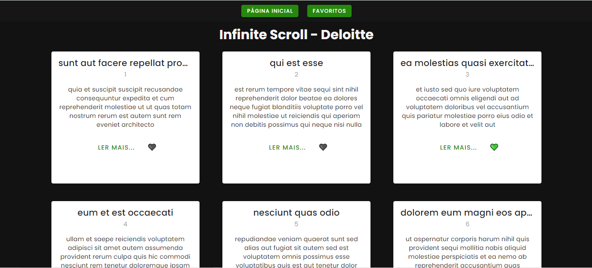
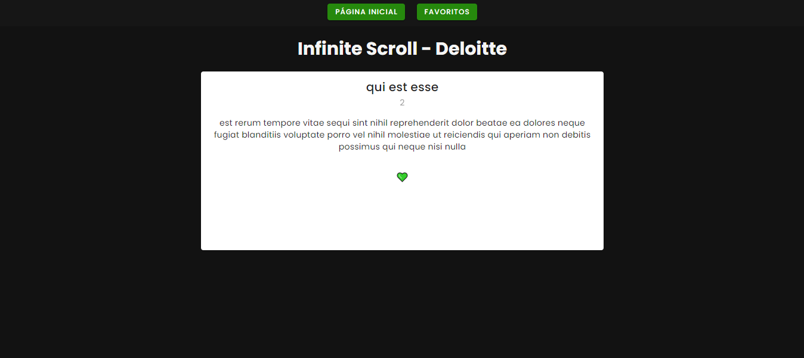
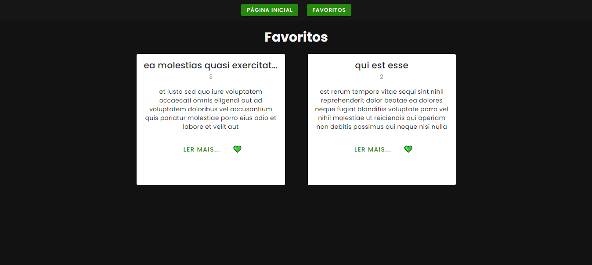
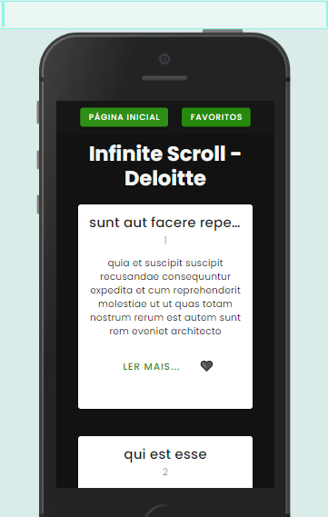
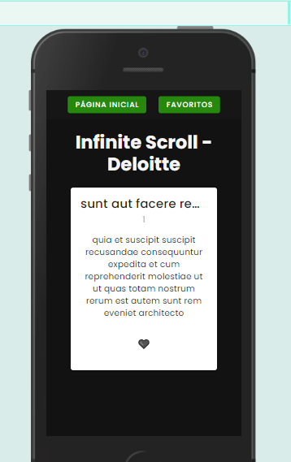
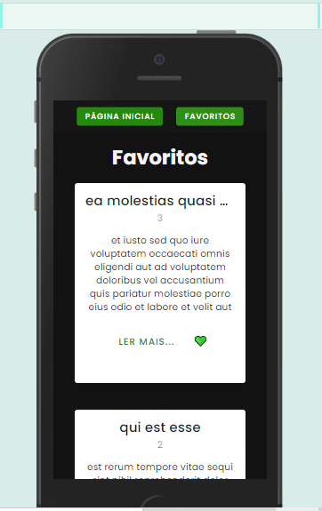

# Deloitte Application

## Sobre

Desafio Prático de Infinte Scroll

### 🔧 Instalação

Instalando as dependencias:

```
npm install
```

Rodando o projeto:

```
npm run dev
```

## 🌐​ Link do Deploy
[Link de Produção  - Aplicação no ar](https://deloitte-test-application.netlify.app/)

## 📱​ Telas do projeto

### Tela Inicial


### Tela de detalhes do Post


### Tela de Favoritos


### Tela Inicial - Mobile


### Tela de detalhes do Post - Mobile


### Tela de Favoritos - Mobile



## ✒️ Autor

- **Daniel Nogueira** - _Web Developer_ - [Github](https://github.com/NogueiraDan)
